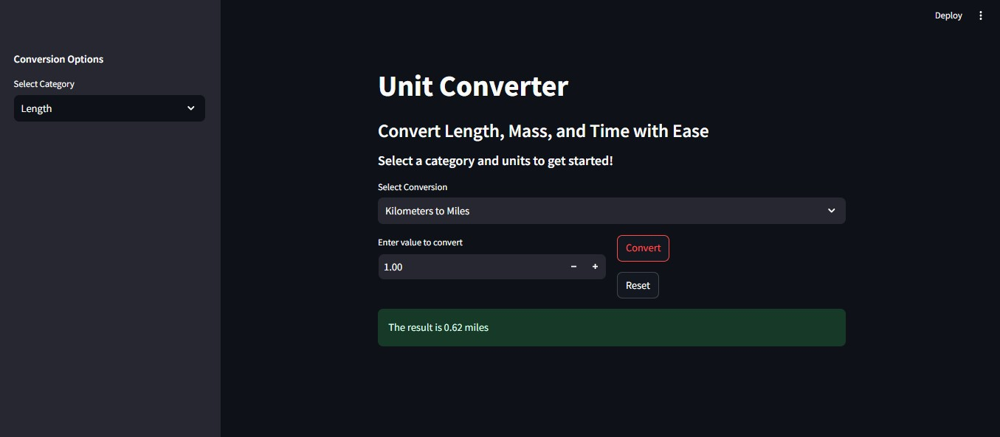

# Unit Converter

A simple and interactive unit conversion tool built with Python and Streamlit. Convert between various units of Length, Mass, and Time with ease!

## Features
- **Categories Supported:** Length, Mass, Time
- **Units Available:**
  - **Length:** Kilometers ↔ Miles, Meters ↔ Feet, Centimeters ↔ Inches
  - **Mass:** Kilograms ↔ Pounds, Grams ↔ Ounces, Kilograms ↔ Tons
  - **Time:** Seconds ↔ Minutes, Minutes ↔ Hours, Hours ↔ Days, Days ↔ Weeks
- **User-Friendly UI:** Sidebar for category selection, responsive layout with input validation.
- **Reset Functionality:** Clear inputs with a single click.
- **Accurate Conversions:** Precise conversion factors used for reliable results.

## Installation
1. Clone the repository:
   ```bash
   git clone https://github.com/RaoAsadMehmood/Unit-Converter.git
   cd unit-converter

   pip install streamlit

   streamlit run unit_converter.py


   Usage
Open the app in your browser (usually at http://localhost:8501).
Select a category from the sidebar (Length, Mass, or Time).
Choose the desired conversion from the dropdown.
Enter a value and click "Convert" to see the result.
Use the "Reset" button to clear the input.


Requirements
Python 3.7+
Streamlit (pip install streamlit)



Contributing
Feel free to fork this repository, submit issues, or create pull requests to add more features or units!

License
This project is licensed under the MIT License - see the LICENSE file for details.

Author
Rao Asad Mehmood